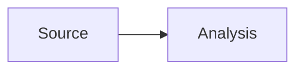

# Writing a Blog post

1. Create a lowercase kebab-case file in this directory, for example `company-name-deep-dive.mdx`.
2. Add the required frontmatter: `title`, `summary`, `date` (`YYYY-MM-DD`), and `category`. `tags` is optional.
3. Write in Markdown/MDX and push the file with the site.

Tables use standard GitHub-flavoured Markdown. For diagrams, use a Mermaid fence:

````mdx

````

MDX content is intentionally content-only: do not use `import`, `export`, or JavaScript expressions inside a post.
