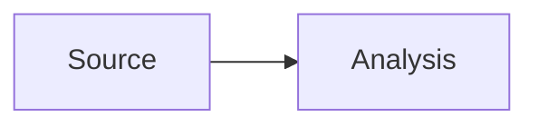

# Writing a Blog post

1. Create a lowercase kebab-case file in this directory, for example `company-name-deep-dive.mdx`.
2. Add the required frontmatter: `title`, `summary`, `date` (`YYYY-MM-DD`), and `category`. `tags` is optional.
3. Write in Markdown/MDX and push the file with the site.

## Social and header images

Use `socialCard` in frontmatter to generate a social/header image. The `version` is part of the image URL: increase it whenever the card changes so browsers and social crawlers receive a fresh image.

```yaml
socialCard:
  type: company-briefing
  version: "1"
  eyebrow: HUBCO
  headline:
    - "HUBCO FY26: cash returns"
    - "meet EV ambition"
  description: "One concise, source-backed line."
  metrics:
    - label: Consolidated EPS
      value: PKR 38.26
      note: +8% YoY
```

Supported generated card types are `article`, `company-briefing`, and `market-wrap`. A `market-wrap` card also needs `label`, `startDate`, and `endDate` for its index chart.

To use a prepared image instead of generating one, reference it directly:

```yaml
socialCard:
  type: image
  src: /blog/my-post/header.png
  alt: "Description of the social image"
```

Place the image in `public/blog/my-post/`, and embed it in the post with:

```mdx
<BlogSocialImage src="/blog/my-post/header.png" alt="Description of the social image" />
```

Tables use standard GitHub-flavoured Markdown. For diagrams, use a Mermaid fence:

````mdx

````

MDX content is intentionally content-only: do not use `import`, `export`, or JavaScript expressions inside a post.

Link a company symbol to its PSX Data Portal page with the built-in `Ticker` component:

```mdx
<Ticker symbol="OGDC" />
```

The August 2026 market wrap-up also uses the built-in `MonthlyMarketHeatmap` component. It accepts literal `startDate`, `endDate`, and optional comma-separated split adjustments such as `adjustments="SRVI:10"`.
